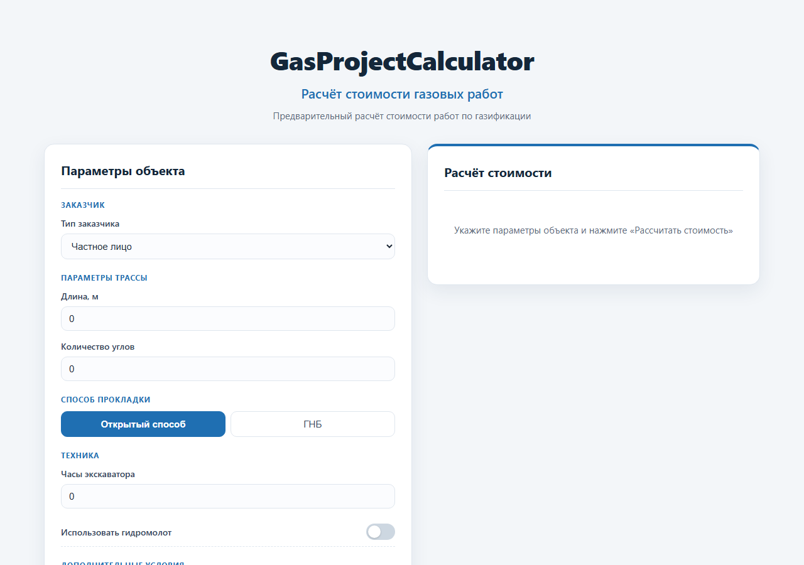
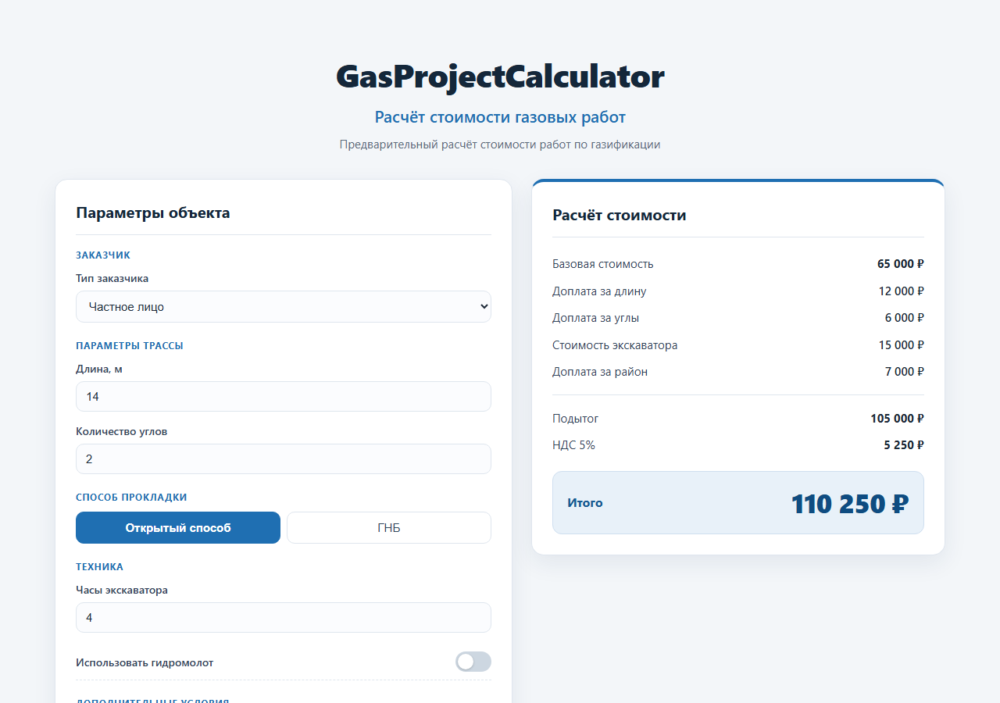

# GasProjectCalculator

Веб-калькулятор стоимости работ по газовым проектам (GSN v1.0). Вводишь параметры объекта — получаешь расшифровку расчёта с НДС.

## Что умеет калькулятор

- Рассчитывает стоимость подключения газа для частного и юридического лица.
- Учитывает доплаты: длина трассы, углы, экскаватор, ГНБ, район, ГРПШ.
- Показывает расшифровку расчёта: базовая стоимость, каждая доплата отдельно, подытог, НДС и итог.
- Валидирует входные данные на сервере (HTTP 422 при некорректных значениях).
- Работает в браузере: HTML-форма → JavaScript → POST /calculate → FastAPI.

## Интерфейс

### Форма расчёта



### Результат расчёта



## Технологии

- Python
- FastAPI
- Pydantic
- HTML / CSS / JavaScript
- unittest (для тестов)

## Бизнес-правила GSN v1.0

- Частник: базовая стоимость **65 000 ₽** до 10 м.
- Юрлицо: базовая стоимость **85 000 ₽** до 10 м.
- Каждый метр сверх 10 м: **+3 000 ₽**.
- Угол: **+3 000 ₽** за каждый.
- ГНБ: **+40 000 ₽**.
- При ГНБ экскаватор **не рассчитывается**.
- Экскаватор: согласно существующим правилам (до 2 ч — 9 000 ₽ / 10 000 ₽ с молотом, далее 3 000 ₽ / 3 500 ₽ за час).
- Район: **+7 000 ₽**.
- ГРПШ: **+40 000 ₽**.
- НДС: **5%** от подытога, в конце.

## Структура проекта

```
GasProjectCalculator/
├── app/
│   ├── main.py            # FastAPI-приложение: GET /, POST /calculate, валидация
│   └── calculator.py      # Бизнес-логика расчёта стоимости
├── frontend/
│   └── index.html         # Пользовательский интерфейс
├── tests/
│   ├── test_calculator.py # Модульные тесты бизнес-логики
│   └── test_main.py       # Интеграционные тесты API
└── requirements.txt
```

## Как установить зависимости

```powershell
python -m venv .venv
.\.venv\Scripts\python.exe -m pip install -r requirements.txt
```

## Как запустить сервер

```powershell
.\.venv\Scripts\python.exe -m uvicorn app.main:app --reload
```

## Где открыть приложение

После запуска сервера откройте в браузере:

```
http://127.0.0.1:8000/
```

## Как запустить тесты

```powershell
.\.venv\Scripts\python.exe -m unittest discover -s tests
```

## Текущий результат тестов

- **57 тестов, 57 проходят (OK).**

## Пример расчёта

Частник, длина 14 м, 2 угла, 4 часа экскаватора без гидромолота, объект в районе, без ГНБ и ГРПШ:

- Базовая стоимость: 65 000 ₽
- Доплата за длину: 12 000 ₽
- Доплата за углы: 6 000 ₽
- Стоимость экскаватора: 15 000 ₽
- Доплата за район: 7 000 ₽
- Подытог: 105 000 ₽
- НДС (5%): 5 250 ₽
- **Итого: 110 250 ₽**

## Ограничения версии

**GSV не реализован** и пока находится за пределами версии GSN v1.0.